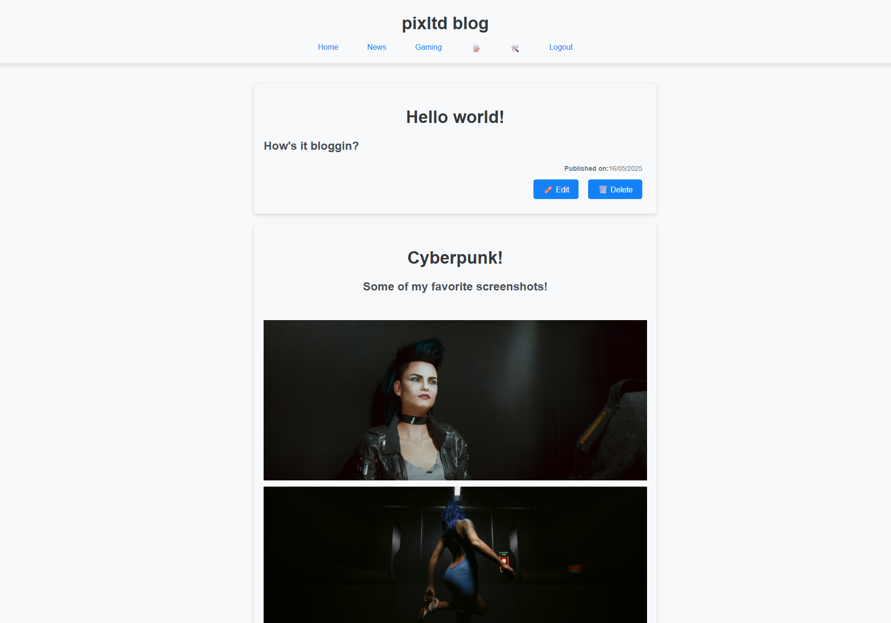

# Redact by pixltd.dev

✨ Small scale redaction system written in react ✨.

This is a lightweight admin interface built with **React + TypeScript** on the frontend and **PHP + SQLite** on the backend. 
It's designed to manage blog posts and handle basic user authentication securely.

## ✨ Features

- Add, edit, view, and list blog posts
- Rich text editor support
- Secure admin-only access
- User login with session-based auth
- First-user account creation flow
- Password reset via email link
- Simple SQLite database (no server setup)

## 🧱 Tech Stack

- Frontend: React + TypeScript + React Router + React Quill
- Backend: PHP 8+ + SQLite
- Styling: Minimal (customizable)
- Authentication: PHP Sessions with cookie-based login